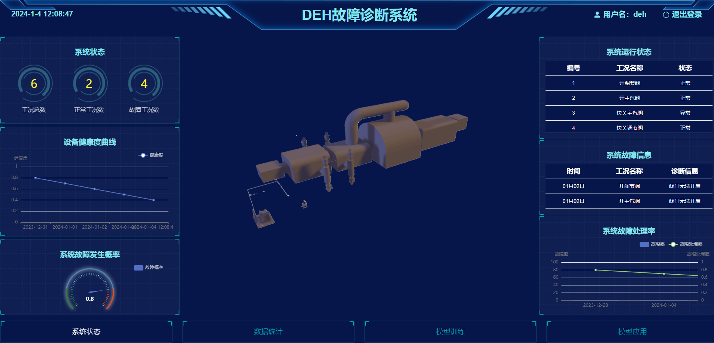
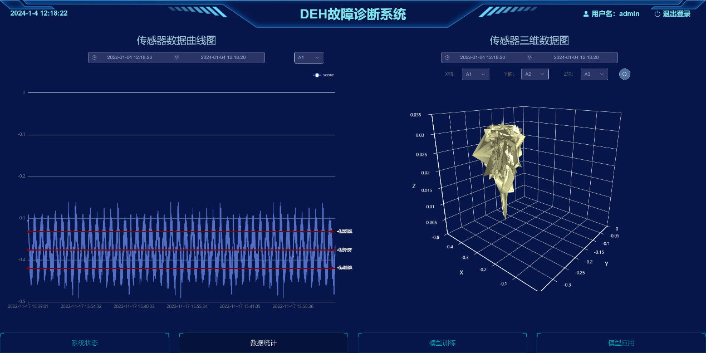
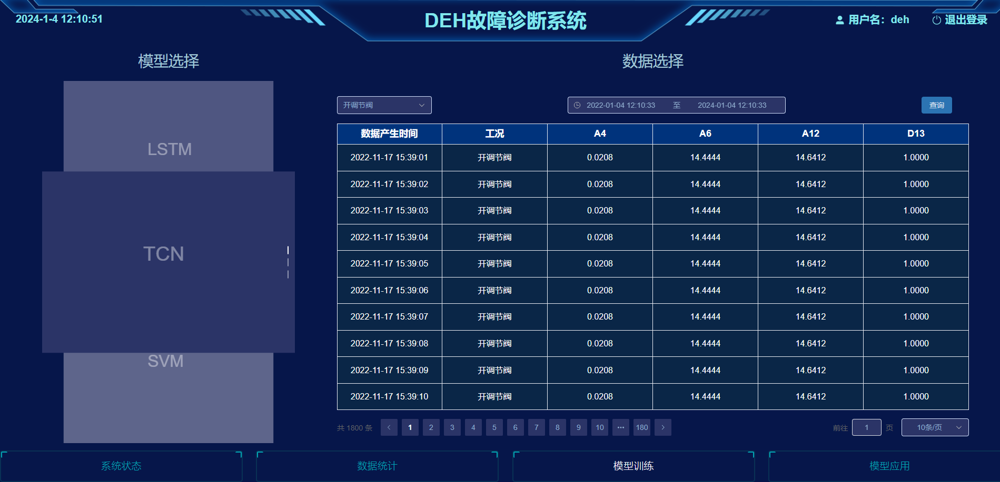
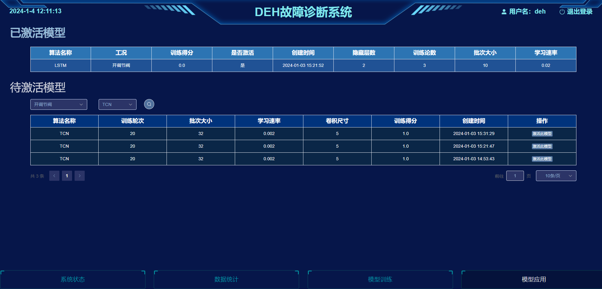

# DEH故障诊断系统前端

## 目录

- [界面总体介绍](#界面总体介绍)
- [界面各功能介绍](#界面各功能介绍)
- [依赖工具及环境](#依赖工具及环境)
- [编译及安装方式](#编译及安装方式)
- [文件目录结构及文件用途说明](#文件目录结构及文件用途说明)

### **界面总体介绍**

DEH 故障诊断系统一共分为四部分：**系统状态、数据统计、模型统计、模型应用**。如下图所示：



- **系统状态**

① 显示系统状态总体运行情况；② 设备健康度曲线，直观展示设备健康度下降趋势，是否需要更换设备；③系统故障发生频率及运行状态。

- **数据统计**

① 统计每一个参数量在相应时间内的实时曲线；②统计相应时间内的相关变量间的 3D 曲线

- **模型统计**

① 人工智能模型对相应时间内的故障进行智能诊断；②展示相应时间内参数的时序数据

-  **模型应用**

利用智能模型对测试数据进行故障诊断

### **界面各功能介绍**
1. #### 登录界面

   

   登录用户名及密码，进入 DEH 故障诊断系统

2. #### 系统状态界面

   

系统状态界面一共包含以下六种实现功能：

（1）**系统状态功能**：显示系统状态总体运行情况

（2）**设备健康曲线**：直观展示设备健康度下降趋势，是否需要更换设备；

（3）**系统故障发生概率**：通过系统工况只管展示系统故障发生概率；

（4）**系统运行状态**：展示系统工况运行状态；

（5）**系统故障信息**：展示系统工况所对应的诊断信息；

（6）**系统故障处理率**：展示每天故障率及处理率的数据情况。

3. #### 数据统计界面

   

   数据统计界面主要包含以下两种功能：

   （1） **传感器数据曲线图**：统计每一个参数量在相应时间内的实时曲线；

   （2）**传感器三维数据图**：统计相应时间内的相关变量间的 3D 曲线。

4. #### 模型训练界面

   

   模型训练界面主要包含以下两种功能：

   （1） **模型选择**：人工智能模型对相应时间内的故障进行智能诊断；

   （2） **数据展示**：展示相应时间内参数的时序数据

5. #### 模型应用界面

   

模型应用界面主要包含以下功能：

（1）**模型应用**：利用智能模型对测试数据进行故障诊断。


### **依赖工具及环境**
- vue3
- pnpm
- element-plus
- pinia-plugin-persistedstate
- axios

### **编译及安装方式**
```bash
# 安装依赖
pnpm install
# 运行
pnpm dev
```

### **文件目录结构及文件用途说明**

```
src
├── api 接口文件夹
│   ├── data.js 数据相关接口文件
│   ├── model.js 模型相关接口文件
│   ├── system.js 系统相关接口文件
│   ├── user.js 用户相关接口文件
├── assets 存放 全局样式 和 图片文件 的文件夹
├── components 组件文件夹
│   ├── ModelUpdatePage 模型训练界面相关组件文件夹
│   ├── MonitoringPage 系统状态界面相关组件文件夹
├── Echarts Echarts文件夹
│   ├── echarts.js echarts文件
├── router 路由文件夹
│   ├── index.js 路由配置文件
├── stores 仓库文件夹
│   ├── modules 仓库文件夹
│   │   ├── user.js 用户仓库
│   ├── index.js pinia配置文件
├── utils 
│   ├── request.js 封装axios模块
├── views 界面相关组件文件夹
│   ├── dataShow 数据统计界面相关组件文件夹
│   ├── layout 界面框架相关组件文件夹
│   ├── login 登录界面相关组件文件夹
│   ├── model 模型界面相关组件文件夹
│   │   ├── ModelUpdatePage 模型训练界面相关组件文件夹
│   │   ├── MonitoringPage 系统状态界面相关组件文件夹
│   ├── layout 界面框架相关组件文件夹
│   ├── ModelUpdatePage 模型训练界面相关组件文件夹
│   ├── MonitoringPage 系统状态界面相关组件文件夹
│   ├── monitoring 系统状态界面相关组件文件夹
│   ├── config  # 决策、规划中costmap配置以及costmap各层参数设置
├── App.vue
├── main.js
├── .eslintrc.js 代码风格配置文件
├── .prettierrc.js 代码风格配置文件
├── index.js
├── package.json
├── pnpm-lock.yaml 
├── vite.config.js
└── README.md
```


